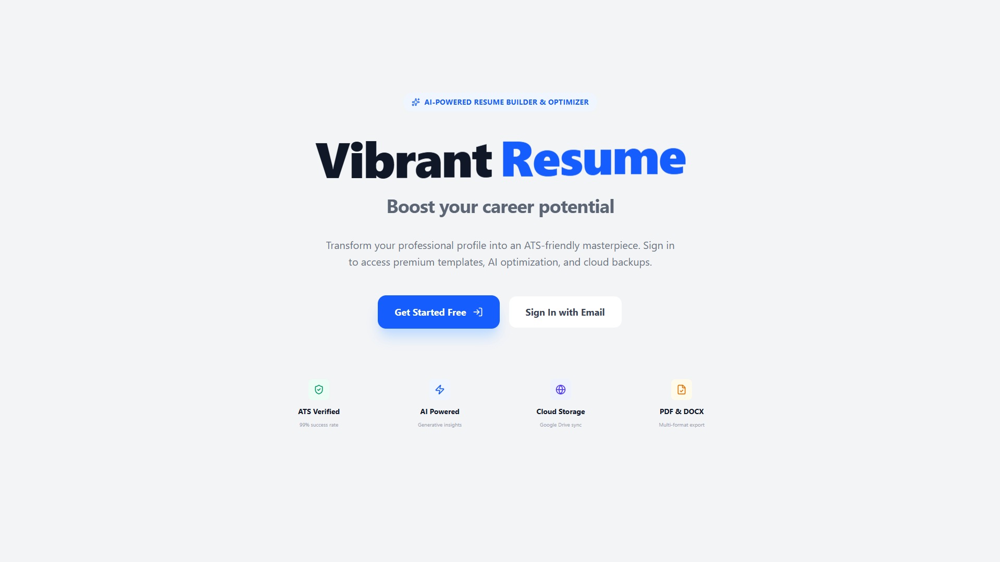
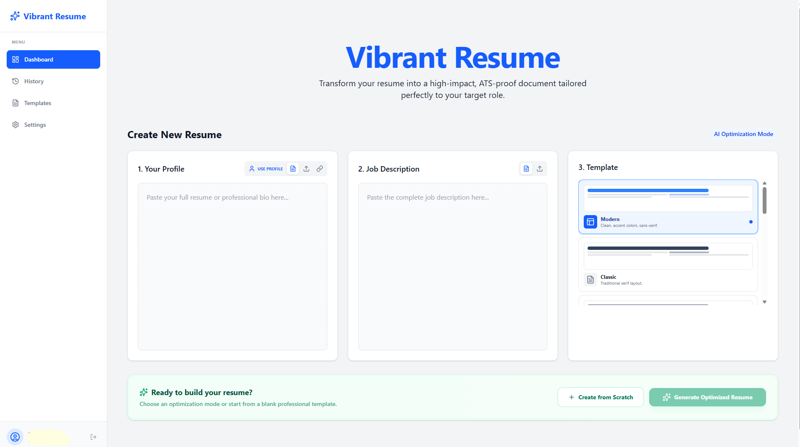
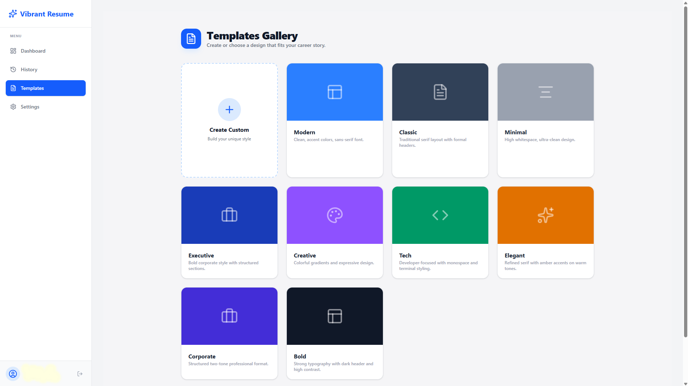
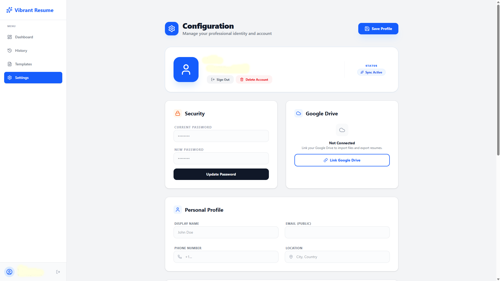

<div align="center">

# 📄 Vibrant Resume

### AI-Powered ATS-Friendly Resume Builder

[](https://nextjs.org/)
[](https://www.typescriptlang.org/)
[](https://tailwindcss.com/)
[](https://vercel.com/)
[](https://cloud.google.com/)
[](LICENSE)

**Create a professional, ATS-optimized resume in minutes — powered by AI.**

[🌐 Live Demo](https://vibrantresume.vercel.app/) · [🐛 Report Bug](https://github.com/parmesh-kumar-ai/vibrant-resume/issues) · [💡 Request Feature](https://github.com/parmesh-kumar-ai/vibrant-resume/issues)

</div>

---

## 🎯 The Problem

In today's competitive job market, most applicants fail to pass ATS (Applicant Tracking System) screening — not because they lack skills, but because:

- Their resume format isn't ATS-compatible
- They miss critical job-relevant keywords
- They use non-standardized templates that get filtered out automatically

**Vibrant Resume** was built to solve exactly these problems.

---

## ✨ Features

- 🧠 **AI-Powered Optimization** — Integrates a cutting-edge AI model to suggest industry-relevant keywords and improve resume content for ATS compatibility
- ✏️ **Grammar Checker** — Built-in grammar analysis to ensure your resume is polished and error-free
- 📋 **Professional Templates** — Multiple ATS-friendly resume templates to choose from, plus a fully custom template option
- 🔧 **High Editing Flexibility** — Edit every section of your resume in real-time after selecting a template
- ☁️ **Google Drive Backup** — Securely save and sync your resume data directly to your Google Drive
- 🔐 **User Authentication** — Secure login for professional, personalized access to your resumes
- 📤 **Export Options** — Download your finished resume as **PDF** or **DOCX** for further editing
- 🚀 **Fast & Responsive** — Built with Next.js for a blazing-fast, mobile-friendly experience

---

## 📊 Previews







---

## 🛠️ Tech Stack

| Layer | Technology |
|---|---|
| **Framework** | [Next.js](https://nextjs.org/) (App Router) |
| **Language** | [TypeScript](https://www.typescriptlang.org/) |
| **Styling** | [Tailwind CSS](https://tailwindcss.com/) |
| **AI Integration** | Latest AI Model API |
| **Authentication** | Google OAuth / Auth |
| **Cloud Storage** | [Google Cloud / Drive API](https://cloud.google.com/) |
| **Deployment** | [Vercel](https://vercel.com/) |
| **Package Manager** | npm |
| **Code Quality** | ESLint |

---

## 📁 Project Structure

```
vibrant-resume/
├── public/               # Static assets
├── scripts/              # Automation and build scripts
├── src/                  # Main application source code
│   ├── app/              # Next.js App Router pages
│   ├── components/       # Reusable UI components
│   ├── lib/              # Utility functions & helpers
│   └── types/            # TypeScript type definitions
├── next.config.ts        # Next.js configuration
├── tailwind.config.ts    # Tailwind CSS configuration
├── tsconfig.json         # TypeScript configuration
└── package.json          # Project dependencies
```

---

## 🚀 Getting Started

### Prerequisites

Make sure you have the following installed:

- [Node.js](https://nodejs.org/) (v18 or above)
- npm (comes with Node.js)

### Installation

1. **Clone the repository**

```bash
git clone https://github.com/parmesh-kumar-ai/vibrant-resume.git
cd vibrant-resume
```

2. **Install dependencies**

```bash
npm install
```

3. **Set up environment variables**

Create a `.env.local` file in the root directory and add the required keys:

```env
# AI API
AI_API_KEY=your_ai_api_key

# Google OAuth & Drive
GOOGLE_CLIENT_ID=your_google_client_id
GOOGLE_CLIENT_SECRET=your_google_client_secret
GOOGLE_REDIRECT_URI=your_redirect_uri

# Next Auth
NEXTAUTH_SECRET=your_nextauth_secret
NEXTAUTH_URL=http://localhost:3000
```

4. **Run the development server**

```bash
npm run dev
```

Open [http://localhost:3000](http://localhost:3000) in your browser to see the app running.

### Build for Production

```bash
npm run build
npm start
```

---

## 🖥️ Usage

1. **Sign in** with your Google account for secure access
2. **Choose a template** from the available professional designs or create a custom one
3. **Fill in your details** — the editor guides you through each section
4. **Let AI optimize** your content with relevant keywords and grammar suggestions
5. **Preview** your resume in real time
6. **Backup to Google Drive** with a single click
7. **Export** as PDF or DOCX and start applying!

---

## 🌐 Live Demo

👉 Try it out here: **[https://vibrantresume.vercel.app/](https://vibrantresume.vercel.app/)**

> ⚠️ Note: Some features in the repository have been modified for security purposes. The live demo reflects the full feature set.

---

## 🤝 Contributing

Contributions are what make open source amazing! Here's how you can help:

1. Fork the repository
2. Create your feature branch: `git checkout -b feature/AmazingFeature`
3. Commit your changes: `git commit -m 'Add some AmazingFeature'`
4. Push to the branch: `git push origin feature/AmazingFeature`
5. Open a Pull Request

Please make sure your code follows the existing ESLint configuration before submitting.

---

## 🐛 Reporting Issues

Found a bug or have a suggestion? [Open an issue](https://github.com/parmesh-kumar-ai/vibrant-resume/issues) and include:

- A clear description of the problem
- Steps to reproduce it
- Expected vs. actual behaviour
- Screenshots if applicable

---

## 📜 License

Distributed under the MIT License. See [`LICENSE`](LICENSE) for more information.

---

## 👨‍💻 Author

**Parmesh Kumar**

[](https://github.com/parmesh-kumar-ai)

---

<div align="center">

If you found this project helpful, please consider giving it a ⭐ — it means a lot!

**Made with ❤️ to help job seekers land their dream jobs.**

</div>
